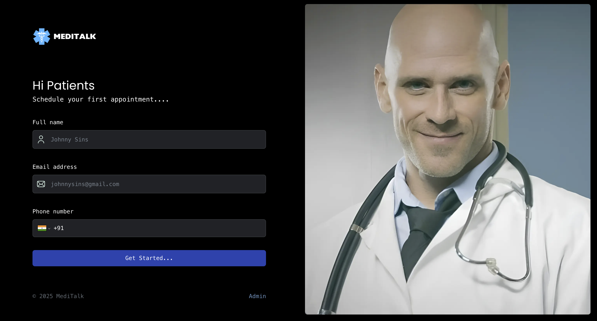

# 🩺 MediTalk

MediTalk is a modern and responsive **Doctor Appointment Management System** built using the powerful Next.js framework. It streamlines the process of scheduling appointments between patients and doctors with an intuitive interface and real-time database integration.

# 🚀 Preview


---

## 🚀 Features

- 📅 Book and manage doctor appointments
- 🔐 Secure authentication (patients & doctors)
- ⚡ Real-time updates and database sync
- 💬 Clear and responsive UI with reusable components
- 🎨 Fully responsive design with modern aesthetics

---

## 🛠 Tech Stack

| Tech             | Description                                        |
|------------------|----------------------------------------------------|
| **Next.js**      | Full-stack React framework for web apps            |
| **TypeScript**   | Static typing for scalable development             |
| **Tailwind CSS** | Utility-first styling for rapid UI building        |
| **Shadcn/UI**    | Accessible, unstyled components styled with Tailwind |
| **Appwrite**     | Backend-as-a-Service for auth & database           |
| **React**        | Core library for building user interfaces          |


## 🔧 Clone the Repository

```bash
git clone https://github.com/your-username/meditalk.git
cd meditalk

---


